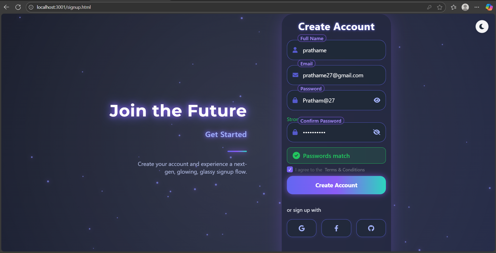
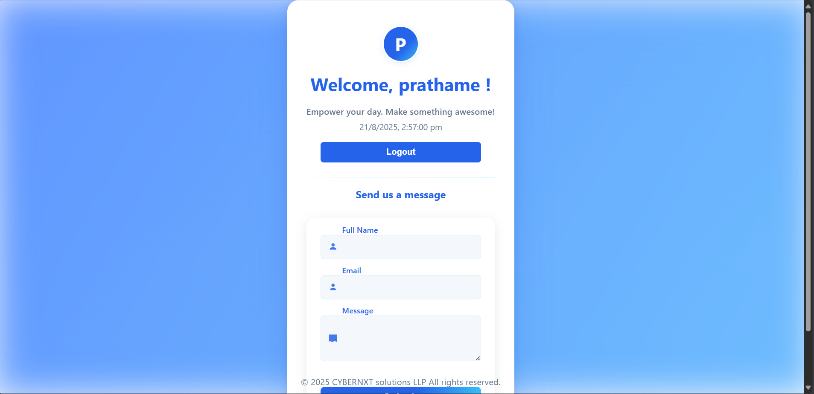
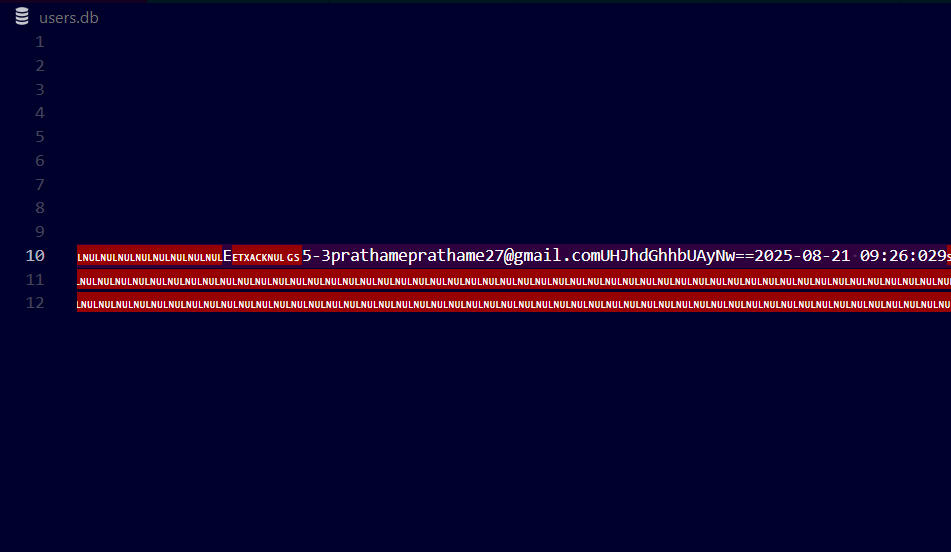
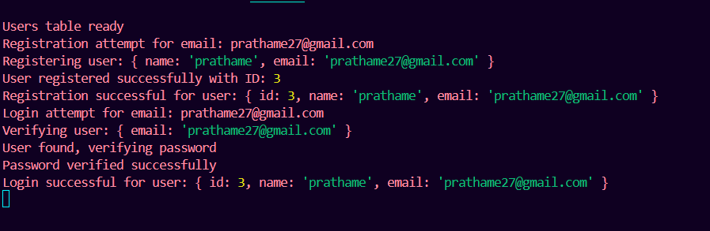

A simple login system using base64 security system.

Overview:
We want you to build a simple frontend-based login system. The user credentials will be stored in a JSON file, but with a small twist — the passwords in that file will be encrypted (you can use something like Base64 or SHA-256 hashing).
Once the user logs in successfully, they should be taken to a dashboard page. If they try to go to the dashboard without logging in, they should be redirected back to the login screen. The login session can be stored in the browser (using localStorage or sessionStorage).

It login into a simple dashboard by with welcome user name 

It is saved in backend by base64 security system

